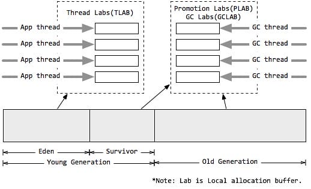
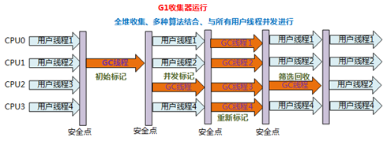

[toc]

## 1 概述

它的设计目标是为了适应现在不断扩大的内存和不断增加的处理器数量，进一步降低暂停时间（pause time），同时兼顾良好的吞吐量。它有如下重要特点：

 - **压缩（compacting）**：G1其回收得到的空间是连续的。这避免了CMS回收器因为不连续空间所造成的问题。如需要更大的堆空间，更多的floating garbage。连续空间意味着G1垃圾回收器可以不必完全采用空闲链表的内存分配方式，G1在连续空间使用了指针碰撞，而非连续空间使用了空闲表；

 - **分区（region）**：G1将内存划分一个个固定大小的region，每个region可以是年轻代或老年代。内存的回收是以region作为基本单位的；

 - **软实时（soft real-time）**：所谓的实时垃圾回收，是指在要求的时间内完成垃圾回收。“软实时”则是指，用户可以指定垃圾回收时间的限时，G1会努力在这个时限内完成垃圾回收，但是G1并不担保每次都能在这个时限内完成垃圾回收。通过设定一个合理的目标，可以让达到90%以上的垃圾回收时间都在这个时限内。

## 2 内存模型

### 2.1 分区

#### 2.1.1 堆的结构

 

G1同样可以通过-Xms/-Xmx来指定堆空间大小。当发生年轻代收集或混合收集时，通过计算GC与应用的耗费时间比，自动调整堆空间大小。如果GC频率太高，则通过增加堆尺寸，来减少GC频率，相应地GC占用的时间也随之降低；目标参数-XX:GCTimeRatio即为GC与应用的耗费时间比，G1默认为9，而CMS默认为99，因为CMS的设计原则是耗费在GC上的时间尽可能的少。另外，当空间不足，如对象空间分配或转移失败时，G1会首先尝试增加堆空间，如果扩容失败，则发起担保的Full GC。Full GC后，堆尺寸计算结果也会调整堆空间。

扩容时机：
gc过于频繁
老年代占用过高
没达到软实时的标准

#### 2.1.2 Region

G1采用了分区(Region)的思路，将整个堆空间分成若干个大小相等的内存区域，每次分配对象空间将逐段地使用内存。因此，在堆的使用上，G1并不要求对象的存储一定是物理上连续的，只要逻辑上连续即可；每个分区也不会确定地为某个代服务，可以按需在年轻代和老年代之间切换。

#### 2.1.3 Card

在每个分区内部又被分成了若干个大小为512 Byte卡片(Card)，标识堆内存最小可用粒度所有分区的卡片将会记录在全局卡片表(Global Card Table)中，分配的对象会占用物理上连续的若干个卡片，当查找对分区内对象的引用时便可通过记录卡片来查找该引用对象(见RSet)。每次对内存的回收，都是对指定分区的卡片进行处理。

#### 2.1.4 巨型对象

 

一个大小达到甚至超过分区大小一半的对象称为巨型对象(Humongous Object)。当线程为巨型分配空间时，不能简单在TLAB进行分配，因为巨型对象的移动成本很高，而且有可能一个分区不能容纳巨型对象。因此，巨型对象会直接在老年代分配，所占用的连续空间称为巨型分区(Humongous Region)。G1内部做了一个优化，一旦发现没有引用指向巨型对象，则可直接在年轻代收集周期中被回收。

巨型对象会独占一个、或多个连续分区，其中第一个分区被标记为开始巨型(StartsHumongous)，相邻连续分区被标记为连续巨型(ContinuesHumongous)。由于无法享受LAB带来的优化，并且确定一片连续的内存空间需要扫描整堆，因此确定巨型对象开始位置的成本非常高，如果可以，应用程序应避免生成巨型对象。

#### 2.1.5 记忆集合Remember Set (RSet)

在串行和并行收集器中，GC通过整堆扫描，来确定对象是否处于可达路径中。然而G1为了避免STW式的整堆扫描，在每个分区记录了一个已记忆集合(RSet)，内部类似一个反向指针，记录引用分区内对象的卡片索引。当要回收该分区时，通过扫描分区的RSet，来确定引用本分区内的对象是否存活（即谁引用了我），进而确定本分区内的对象存活情况。

事实上，并非所有的引用都需要记录在RSet中，如果一个分区确定需要扫描，那么无需RSet也可以无遗漏的得到引用关系。那么引用源自本分区的对象，当然不用落入RSet中；同时，G1 GC每次都会对年轻代进行整体收集，因此引用源自年轻代的对象，也不需要在RSet中记录。最后只有老年代的分区可能会有RSet记录，这些分区称为拥有RSet分区(an RSet’s owning region)。

#### 2.1.6 Per Region Table (PRT)

RSet在内部使用Per Region Table(PRT)记录分区的引用情况。由于RSet的记录要占用分区的空间，如果一个分区非常"受欢迎"，那么RSet占用的空间会上升，从而降低分区的可用空间。G1应对这个问题采用了改变RSet的密度的方式，在PRT中将会以三种模式记录引用：

 - 稀少：直接记录引用对象的卡片索引。
 - 细粒度：记录引用对象的分区索引。
 - 粗粒度：只记录引用情况，每个分区对应一个比特位由上可知，粗粒度的PRT只是记录了引用数量，需要通过整堆扫描才能找出所有引用，因此扫描速度也是最慢的。

### 2.2 分代

 

#### 2.2.1 分代垃圾收集

分代垃圾收集可以将关注点集中在最近被分配的对象上，而无需整堆扫描，避免长命对象的拷贝，同时独立收集有助于降低响应时间。虽然分区使得内存分配不再要求紧凑的内存空间，但G1依然使用了分代的思想。与其他垃圾收集器类似，G1将内存在逻辑上划分为年轻代和老年代，其中年轻代又划分为Eden空间和Survivor空间。但年轻代空间并不是固定不变的，当现有年轻代分区占满时，JVM会分配新的空闲分区加入到年轻代空间。

整个年轻代内存会在初始空间-XX:G1NewSizePercent(默认整堆5%)与最大空间(默认60%)之间动态变化，且由参数目标暂停时间-XX:MaxGCPauseMillis(默认200ms)、需要扩缩容的大小以-XX:G1MaxNewSizePercent及分区的已记忆集合(RSet)计算得到。当然，G1依然可以设置固定的年轻代大小(参数-XX:NewRatio、-Xmn)，但同时暂停目标将失去意义。

同时设置这两个参数时，JVM 会优先考虑 MaxGCPauseMillis 参数。 如果 MaxGCPauseMillis 参数的值较小，JVM 会尽力缩短垃圾收集停顿时间，即使这会导致垃圾收集时间占总时间的比率超过 GCTimeRatio 参数设置的值。

年轻代的region又分为eden region和survivor region。

#### 2.2.2 本地分配缓冲（Local Allocation Buffer）

值得注意的是，由于分区的思想，每个线程均可以"认领"某个分区用于线程本地的内存分配，而不需要顾及分区是否连续。因此，每个应用线程和GC线程都会独立的使用分区，进而减少同步时间，提升GC效率，这个分区称为本地分配缓冲区(LAB)。

其中，应用线程可以独占一个本地缓冲区(TLAB)来创建的对象，而大部分都会落入Eden区域(巨型对象或分配失败除外)，因此TLAB的分区属于Eden空间；而每次垃圾收集时，每个GC线程同样可以独占一个本地缓冲区(GCLAB)用来转移对象，每次回收会将对象复制到Suvivor空间或老年代空间；对于从Eden/Survivor空间晋升(Promotion)到Survivor/老年代空间的对象，同样有GC独占的本地缓冲区进行操作，该部分称为晋升本地缓冲区(PLAB)。

## 3 收集集合（Collection Set）

Collection Set（CSet），它记录了GC要收集的Region集合，集合里的Region可以是任意年代的

### 3.1 年轻代收集集合（CSet of Young Collection）

应用线程不断活动后，年轻代空间会被逐渐填满。当JVM分配对象到Eden区域失败(Eden区已满)时，便会触发一次STW式的年轻代收集。在年轻代收集中，Eden分区存活的对象将被拷贝到Survivor分区；原有Survivor分区存活的对象，将根据任期阈值(tenuring threshold)分别晋升到PLAB中，新的survivor分区和老年代分区。而原有的年轻代分区将被整体回收掉。

同时，年轻代收集还负责维护对象的年龄(存活次数)，辅助判断老化(tenuring)对象晋升的时候是到Survivor分区还是到老年代分区。年轻代收集首先先将晋升对象尺寸总和、对象年龄信息维护到年龄表中，再根据年龄表、Survivor尺寸、Survivor填充容量-XX:TargetSurvivorRatio(默认50%)、最大任期阈值-XX:MaxTenuringThreshold(默认15)，计算出一个恰当的任期阈值，凡是超过任期阈值的对象都会被晋升到老年代。

### 3.2 混合收集集合（CSet of Mixed Collection）

年轻代收集不断活动后，老年代的空间也会被逐渐填充。当老年代占用空间超过整堆比IHOP阈值-XX:InitiatingHeapOccupancyPercent(默认45%)时，G1就会启动一次混合垃圾收集周期。为了满足暂停目标，G1可能不能一口气将所有的候选分区收集掉，因此G1可能会产生连续多次的混合收集与应用线程交替执行，每次STW的混合收集与年轻代收集过程相类似。

为了确定包含到年轻代收集集合CSet的老年代分区，JVM通过参数混合周期的最大总次数-XX:G1MixedGCCountTarget(默认8)、堆废物百分比-XX:G1HeapWastePercent(默认5%)。通过候选老年代分区总数与混合周期最大总次数，确定每次包含到CSet的最小分区数量；根据堆废物百分比，当收集达到参数时，不再启动新的混合收集。而每次添加到CSet的分区，则通过计算得到的GC效率进行安排。

对 Old Regions 的收集会同时涉及若干个 Young 和 Old Regions，因此被称为 Mixed GC。Mixed GC 很多地方都和 Young GC 类似，不同之处是：它还会选择若干最有潜力的 Old Regions（收集垃圾的效率最高的 Regions），这些选出来要被 Evacuate 的 Region 称为本次的 Collection Set (CSet)。

Mixed GC 是工作量最为繁重的一个环节，如果不加以控制，就会像 CMS 一样发生长时间的 Full GC 停顿。这时候 Region 的设计就发挥出优越性了：只要把每次的 Collection Set 规模控制在一定范围，就能把每次收集的停顿时间软性地控制在 MaxGCPauseMillis 以内。起初这个控制可能不太精准，随着 JVM 的运行估算会越来越准确。

## 4 三色标记算法

### 4.1 介绍

CMS和G1在并发标记时使用的是同一个算法：三色标记法，使用白灰黑三种颜色标记对象。白色是未标记；灰色自身被标记，自身引用的对象未标记；黑色自身与自身引用对象都已标记。

GC 开始前所有对象都是白色，GC 一开始所有根能够直达的对象被压到栈中，待搜索，此时颜色是灰色。然后灰色对象依次从栈中取出搜索子对象，子对象也会被涂为灰色，入栈。当其所有的子对象都涂为灰色之后该对象被涂为黑色。当 GC 结束之后灰色对象将全部没了，剩下黑色的为存活对象，白色的为垃圾。

### 4.2 问题

#### 4.2.1 浮动垃圾

已被标记为黑色或灰色的节点在用户并行线程中被标记为空，本次不回收需要在下一回合回收。

#### 4.2.2 漏标

在老年代已被标记为白色的节点（aka，不可达），在用户并行线程执行后变成可达，i.e.，黑色引用了白色，或者年轻代引用了白色。这个时候在重新标记阶段需要对这部分的白色节点做特殊标记处理。

1) Increment update
    > CMS的处理方式是在并发标记阶段统计黑色引用白色的数量，重新标记阶段从这些黑色节点开始重新进行可达性分析。
2) SATB（Snapshot at the Beginning）
    > G1的处理方式是并发标记开始的时候对GC Root的所有可达的对象建立快照，在并发标记进行的时候如果应用程序快照对象的引用进行修改，那么就会记录在SATB日志中，后面重新标记阶段会对SATB日志中的对象进行可达性分析。

## 5 活动周期

 

 

### 5.1 年轻代收集周期

收集年轻代，标准的eden转survivor，survivor的from到to。

### 5.2 并发标记周期

事实上，当达到IHOP阈值时，G1并不会立即发起并发标记周期，而是等待下一次年轻代收集，利用年轻代收集的STW时间段，完成初始标记，这种方式称为借道(Piggybacking)。

#### 5.2.1 初始标记 Initial Mark

扫描并标记GC Root对象直接可达的老年代存活对象。

Initial Mark并没有独立的执行阶段，而是嵌入YoungGC中执行的，其停顿时间会被分摊，因此实际的开销非常低。

#### 5.2.2 根分区扫描 Root Region Scanning

在初始标记暂停结束后，年轻代收集也完成的对象复制到Survivor的工作，应用线程开始活跃起来。此时为了保证标记算法的正确性，所有新复制到Survivor分区的对象，都需要被扫描并标记成根，这个过程称为根分区扫描(Root Region Scanning)，同时扫描的Suvivor分区也被称为根分区(Root Region)。

扫描Root Region并标记所有可达的存活对象。

此处的Root Region就是先前YoungGC中生成的Survivor区域，其包含的对象都会被视为GC Root。

为了避免移动对象对标记产生影响，该过程必须在下次YoungGC启动前完成，因为每次GC会产生新的存活对象集合。

#### 5.2.3 并发标记 Concurrent Marking

使用三色标记算法。

从 GC Roots 对堆中的对象进行可达性分析，找出存活的对象，此过程可能被 young GC 中断，并发标记阶段产生的新的引用（或引用的更新）会被 SATB 的 write barrier 记录下来，同时，并发标记线程还会定期检查和处理STAB全局缓冲区列表的记录，更新对象引用信息。

在此阶段中，如果发现区域中的所有对象都是垃圾，那这个区域会立即被回收。同时，并发标记过程中，会计算每个区域中对象的存活比例。

#### 5.2.4 重新标记 Remark

重新标记阶段是为了修正在并发标记期间，因应用程序继续运作而导致标记产生变动的那一部分标记记录，就是去处理剩下的 SATB日志缓冲区和所有更新，找出所有未被访问的存活对象。

#### 5.2.5 清除 Cleanup

该阶段主要是排序各个 Region 的回收价值和成本，并根据用户所期望的GC停顿时间来制定回收计划。

### 5.3 混合收集周期

经历并发标记周期，识别出高收益的老年代分区，前文已述。但随后G1并不会马上开始一次混合收集，而是让应用线程先运行一段时间，等待触发一次年轻代收集。在这次STW中，G1将保准整理混合收集周期。接着再次让应用线程运行，当接下来的几次年轻代收集时，将会有老年代分区加入到CSet中，即触发混合收集，这些连续多次的混合收集称为混合收集周期（Mixed Collection Cycle）。

### G1模式下的FullGC
在G1的正常工作流程中没有Full GC的概念，老年代的收集全靠Mixed GC来完成。

但是，毕竟Mixed GC有搞不定的时候，如果Mixed GC实在无法跟上程序分配内存的速度，导致老年代填满无法继续进行Mixed GC，就会切换到G1之外的Serial Old GC来收集整个堆（包括Young、Old、Metaspace），这才是真正的Full GC（Full GC不在G1的控制范围内），进入这种状态的G1就跟-XX:+UseSerialGC的Full GC一样（背后的核心代码是两者共用的）。

这就是为什么不建议G1模式下参数-XX:MaxGCPauseMillis=200 的值设置太小，如果设置太小，可能导致每次Mixed GC只能回收很小一部分Region，最终可能无法跟上程序分配内存的速度，从而触发Full GC。

full gc跟其他gc一样。