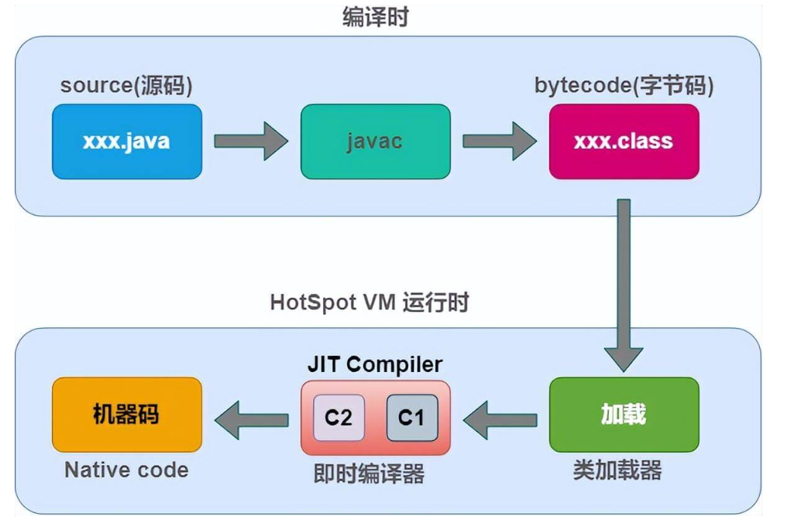
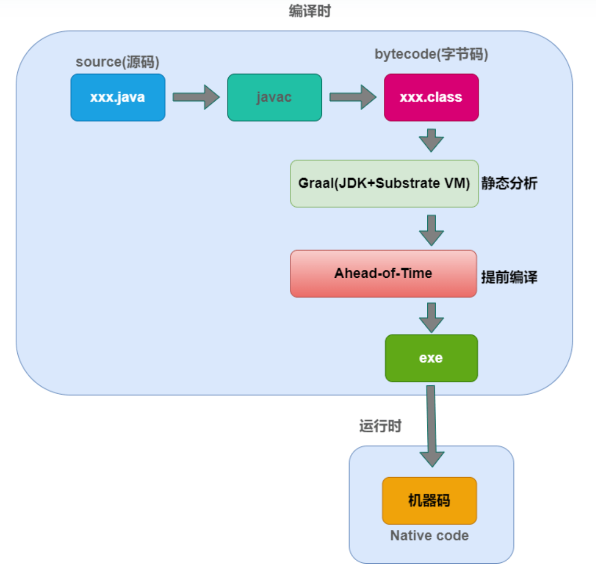

## 1 概述

GraalVM同样由Oracle公司开发，是基于HotSpot上增强的一个跨语言的全栈虚拟机。全栈虚拟机是指他可以作为大部分语言的运行平台（包括Java、Scala、Groovy、Kotlin、JavaScript、Ruby、Python、C、C++等）。还可以编译多语言混合开发的程序（不同的语言中混用其它语言的接口或方法等）。针对Java而言的话，由于它是基于HotSpot开发的，天生就可以作为一套完全符合Java标准的虚拟机来使用。差异只在即时编译器上：将HotSpot内置的C2换成了Graal。

## 2 编译

### 2.1 SubstrateVM

GraalVM的核心就是Graal编译器，一款优秀的JIT编译器。它即可以当作JIT编译器使用，也可以用作提前编译的静态编译器。

SubstrateVM是GraalVM的一个AOT（Ahead-Of-Time）编译框架。AOT即提前编译，和即时编译（JIT）不同，AOT是在程序运行之前，就将字节码转换为机器码，可以直接编译成可独立运行的执行文件（本地镜像）或共享库。

SubstrateVM 的设计初衷是提供一个高启动性能、低内存开销，并且能够无缝衔接 C 代码的 Java 运行时。SubtrateVM完全脱离了HotSpot虚拟机，并拥有独立的运行时，包含异常处理，同步，线程管理，内存管理（垃圾回收）和 JNI 等组件。
从执行时间上来划分，SubstrateVM可以分为两部分：Native Image Generator以及SubstrateVM运行时。

### 2.2 Native Image Generator

包含了AOT 编译逻辑。它本身是一个 Java 程序，将使用 Graal 编译器将 Java 类文件编译为可执行文件或者动态链接库。
在进行编译之前，native image generator 将采用指针分析（points-to analysis），从用户提供的程序入口出发，探索所有可达的代码。在探索的同时，它还将执行初始化代码，并在最终生成可执行文件时，将已初始化的堆保存至一个堆快照之中。这样一来，SubstrateVM 将直接从目标程序开始运行，而无须重复进行 Java 虚拟机的初始化。

### 2.3 运行时

一个脱离了HotSpot的精简运行时，经过 AOT 编译的目标程序将跑在该运行时之上。
SubstrateVM的启动时间和内存开销非常少，而且由于是提前编译，则程序一启动便可以获得良好的性能（性能峰值可能会比JIT更差，但是稳定性会更好）。
但是它目前来看也有很多问题：

- 很明显它没有办法再做到 “Write once，Run anywhere” 了。
- Java反射机制是在运行期间动态的调用API，但是具体调用哪些接口，很明显在程序没有运行起来时的编译期是没办法知道的。需要开发者明确的告知GaalVM有哪些代码可能被反射调用（通过JSON配置文件的形式），这就很恶心了，基本上是不可实现的。
- 本地镜像由于没有运行在HotSpot上，那么一切HotSpot虚拟机本身的内部接口（JVMTI、JVMCI等）都不复存在。大量的Agent的调试工具都无法使用，噩梦！

## 3 Truffle

Truffle是GraalVM的另一个关键组件，它是一款编程语言的实现框架，它提供了一套API，可以用它来实现某一门语言的AST解释器，并可以被Graal编译器优化。目前大部分语言的解释器都已经由Oracle实现了，从上图可以看到：JS、Ruby、R、Python、Sulong（Sulong是一个针对LLVM IR的解释器）。也有很多人实现了其它语言的解释器并放在了Github上。

Truffle的精华在于：所有语言都是使用统一的协议来开发对应的解释器，也就意味着，运行时所有解释器都可以通过统一的协议来操作不同编程语言中的对象。所有不语言编写或混合编写的代码，在运行时都是一样的。都可以像优化正常代码一样，来优化不同语言或多语言写的程序，不会有任何额外的开销。

这意味着当你使用Java开发时，发现Python有一个非常好用的库，但是Java没有。这时你不用再使用Java再实现一遍Pyhton库，直接在Java代码中调用Python库即可。

## 4 Spring Graal Native

上面我们说到，GraalVM中最核心，也是和我们目前微服务架构最适配的一个功能：本地镜像 存在诸多的问题，其中最重要的一点是数量庞大的第三方库中使用的各种反射和运行期间对字节码的生成和修改操作，让依赖这些框架的程序一旦脱离了Java虚拟机，肯定会出现各种各样的问题，让本地镜像成了镜花水月。GraalVM团队明确表明为了GraalVM的可持续发展和可维护性，不会兼容现有的JVM生态，这就需要大量的三方库来适配GraalVM。

所以为了推进Java生态向GraalVM兼容，GraalVM拉动了一个Java生态最屌的一个派系：Spring，于是便有了Spring Graal Native这个项目。Spring Graal Native项目主要是用来解决Spring全家桶在GraalVM上运行的适配问题。

## 5 对比

### 5.1 JVM编译

 

### 5.2 GraalVM AOT编译

 

## 6 结尾

### 6.1 云原生Java的问题

- 冷启动速度较慢。
- 应用预热时间过长，无法立即达到性能峰值。
- 内存、CPU等系统资源占用高。
- Java构建的应用程序繁重，执行还需要具备JDK环境。

### 6.2 GraalVM解决了什么

使用GraavlVM的AOT会使编译时间大大增加，编译后的jar包文件大小也会增加，但是提供了一个可执行的文件，因而启动速度会得到极大的提高，并且启用后内存占用也会极大的降低。
可以使Java在云原生环境达到秒级的弹性。