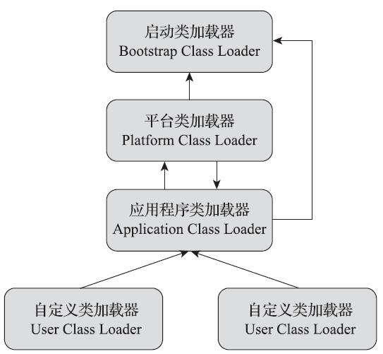

[toc]

## 1 概述
JDK9引入了一个新的特性叫做JPMS（Java Platform Module System），也可以叫做Project Jigsaw。模块化的本质就是将一个大型的项目拆分成为一个一个的模块，每个模块都是独立的单元，并且不同的模块之间可以互相引用和调用。

为了表明Java模块化的决心，从Java 9开始，原有的Java标准库已经由一个单一巨大的rt.jar分拆成了几十个模块，这些模块以.jmod扩展名标识。

## 2 意义

### 2.1 显示声明

每个模块需要显示的声明需要依赖的包，以及可以暴露的包。

### 2.2 封装

每个模块划分明确的边界，可以做到只暴露需要的接口和类，完美隐藏实现细节和其他的类和接口。

### 2.3 按需引用

合理的划分模块可以减少包的大小，仅仅引用需要的模块，避免随着业务的变化包体积变得越来越大。并且可以独立打包替换一些公共的模块，提高发版效率。

## 3 使用模块化

### 3.1 模块类型

#### 3.1.1 命名模块（Named Module）

命名模块也称为应用模块(Application Module)，通常在模块根目录下有`module-info.java`文件的话，那么该模块就称为命名模块，我们编写的模块一般都属于这种类型，还有很多第三方的依赖也可以归类于此，只要第三方依赖的维护者将库迁移到自己定义的模块即可，那么我们就可以在自己的模块中引用这些依赖。

#### 3.1.2 未命名模块（Unnamed Module）

未命名模块指的是不包含`module-info.java`的包。classpath中的未命名模块可以引用所有的包，包含命名模块和其他未命名模块，但是命名模块无法引用未命名模块中的包。

#### 3.1.3 自动模块（Automatic Module）

任何在modulepath中的未命名模块会自动变为自动模块，自动模块会对外暴露所有的包，即其他模块可以通过requires引用自动模块，自动模块也可以引用其他模块exports的包。自动模块的有固定的命名规则，自动模块会移除文件扩展名以及版本好，然后使用“.”替换所有非字母字符（e.g.，`spring-core-4.3.12.jar` 生成的模块名为 `spring.core`，其他模块就可以通过`requires spring.core` 来引用其中的类）。

### 3.2 语法

#### 3.2.1 module

```java
// 声明modular.demo.persistent模块
module modular.demo.persistent {
    // 声明导出的包
    exports com.example.modulardemo.persistent.domain;
    exports com.example.modulardemo.persistent.dao;
​
    // 声明需要依赖的模块
    requires modular.demo.common;
    requires mybatis.plus;
    requires mybatis.plus.core;
    requires mybatis.plus.annotation;
}

module modular.demo.service {
    exports com.example.modulardemo.service;
    exports com.example.modulardemo.service.impl;
    
    requires modular.demo.persistent;
    requires spring.context;
    requires spring.beans;
}

module modular.demo.web {
    requires spring.web;
    requires spring.beans;
    requires spring.boot;
​
    requires modular.demo.service;
    requires modular.demo.persistent;
    requires modular.demo.common;
    requires org.mybatis.spring;
    requires spring.boot.autoconfigure;
​
    // 声明com.example.modulardemo包对spring开放，允许spring在运行期间通过反射机制访问其代码
    opens com.example.modulardemo to spring.core, spring.beans, spring.boot, spring.context, spring.web;
}
```

#### 3.2.2 requires

指定当前模块依赖的模块。

#### 3.2.3 requires static

编译时检查依赖关系，以确保程序在运行时能够正确地工作。这对于使用反射或动态类加载的程序特别有用，因为这些程序在编译时无法检测到某些依赖关系，需要在运行时才能动态地加载类。

#### 3.2.4 requires transitive

假如模块A依赖模块B，现在C模块不仅想使用A模块还想使用B模块，那么C模块就使用该指令来获取B的访问权限，这种对外暴露传递依赖的模块也称为“隐式读取（implied read）”。

#### 3.2.5 exports

指定模块中可以被外部依赖的包。

#### 3.2.6 exports to

该指令用来限定哪些模块可以访问导出类，允许开发者通过逗号分隔的列表指定哪些模块可以依赖指定导出的包，这种方式也称为限定导出（qualified export）。

例如，将`com.example.mypackage`指定导出给模块`com.example.specificmodule`：

```java
module com.example.mymodule {
    exports com.example.mypackage to com.example.specificmodule;
}
```

#### 3.2.7 open

指定模块在运行时可以被外部模块反射的包。

#### 3.2.8 open to

指定模块在运行时可以被指定外部模块反射的包。

例如，将`com.example.mypackage`指定让`com.example.specificmodule`模块反射：

```java
module com.example.mymodule {
    opens com.example.mypackage to com.example.specificmodule;
}
```

#### 3.2.9 uses和provides with

模块通过`uses`声明服务接口，其他模块通过`provides`声明服务接口的实现类，运行时，模块可以通过SPI的方式加载所有可用的服务实现。

例如：

```java
// 声明接口
module com.example.interface {
    exports com.example.myservice;
}

// 使用接口
module com.example.consumer {
    requires com.example.interface;
    // 声明需要使用SPI调用的接口
    uses com.example.myservice.MyService;
}

// 提供接口实现
module com.example.provider {
    requires com.example.interface;
    // 声明接口的实现
    provides com.example.myservice.MyService with com.example.provider.MyServiceImpl;
}

```

### 3.3 打包和执行

1) 将`module-info.java`放入package的根目录。

2) 使用`javac`指令编译java文件为class文件。

3) 使用`jar`指令打包class文件为jar，指定main class。

4) 使用`jmod`指令将jar包转换成jmod模块文件。

5) 使用`jlink`指令将jmod文件打包成可执行的jre。

6) 使用`java`指令执行打包好的jre。

### 3.4 类加载

当平台及应用程序类加载器收到类加载请求，在委派给父加载器加载前，要先判断该类是否能够归属到某一个系统模块中，如果可以找到这样的归属关系，就要优先委派给负责那个模块的加载器完成加载，也许这可以算是对双亲委派的第四次破坏。

<div></div>