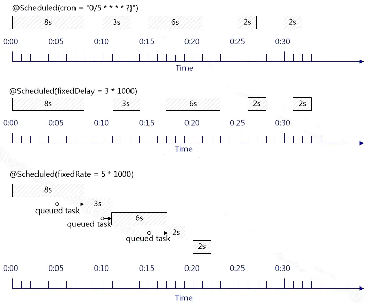

### 1 使用定时任务

###### 1) SpringBoot入口类配置EnableScheduling注解启用定时任务

```java
@EnableScheduling
@SpringBootApplication
public class Application {
	public static void main(String[] args) {
		SpringApplication.run(Application.class, args);
	}
}
```

###### 2) 在目标方法中添加@Scheduled注解

```java
@Component
public class ScheduleTask {

	// 每次任务间隔2秒
	@Scheduled(fixedRate = 2000)
	public void fixedRateScheduleTask() {
		System.out.println("fixedRateScheduleTask");
	}

	// 每隔2秒执行一次
	@Scheduled(fixedDelay = 2000)
	public void fixedDelayScheduleTask() {
		System.out.println("fixedDelayScheduleTask");
	}

	// 每隔2秒执行一次
	@Scheduled(cron = "0/2 * * * * ?")
	public void cronScheduleTask() {
		System.out.println("cronScheduleTask");
	}

}
```

------


### 2 原理

开启@EnableScheduling注解后，Scheduled注解后处理器，项目启动时会扫描所有标记了@Scheduled注解的方法，封装成ScheduledTask注册起来。

------


### 3 注意事项

##### 3.1 常用配置

- initialDelay等待多少时间才开始运行。
- cron每一次执行完成后，再遇到给定的规则时间点上触发。
- fixedDelay每次执行任务的间隔时间，受上一次执行时间的影响。
- fixedRate固定的速率执行，如果一段时间内任务阻塞，会积攒任务次数，在恢复时一次性执行完成。

##### 3.2 单线程的影响

Spring的定时任务是以单线程的方式运作，关于每一种的配置影响如下。

<div></div>

- 如果使用cron来做定时间隔执行，如果上一次任务耽误了下一次的开始执行时间，那么下一次任务会在下下次执行。
- fixedDelay的特点是每个任务的间隔一定是所设置的时间间隔。
- fixedRate的特点是如果上一次任务耽误了下一次的开始执行时间，那么任务会被堆积(会尽快执行完所有任务)，下一次任务会在上一次任务执行完立即执行。

------


### 4 自定义定时器

##### 4.1 选择定时任务的方式

1. 从容器中找到所有的接口SchedulingConfigurer的实现类。
2. 如果没找到，使用唯一类型org.springframework.scheduling.TaskScheduler的bean或id是taskScheduler类型是TaskScheduler的bean。
3. 如果还没找到，继续查找唯一的ScheduledExecutorService的bean或id是taskScheduler的ScheduledExecutorService的bean。
4. 如果还没找到，Spring会创建一个默认的单线程的调度器，如果需要多线程调度需要自己实现。

##### 4.2 自定义定时任务

###### 1) 实现SchedulingConfigurer接口

```java
@Configuration 
public class SchedulerConfig implements SchedulingConfigurer {

	// 可以使用@Value在properties配置文件中配置
	@Override
	public void configureTasks(ScheduledTaskRegistrar scheduledTaskRegistrar) {
		ThreadPoolTaskScheduler threadPoolTaskScheduler = new ThreadPoolTaskScheduler();
		// 线程池大小为10
		threadPoolTaskScheduler.setPoolSize(10);
		// 设置线程名称前缀
		threadPoolTaskScheduler.setThreadNamePrefix("scheduled-thread-");
		// 设置线程池关闭的时候等待所有任务都完成再继续销毁其他的Bean 
		threadPoolTaskScheduler.setWaitForTasksToCompleteOnShutdown(true);
		// 设置线程池中任务的等待时间，如果超过这个时候还没有销毁就强制销毁，以确保应用最后能够被关闭，而不是阻塞住 
		threadPoolTaskScheduler.setAwaitTerminationSeconds(60);
		// 这里采用了CallerRunsPolicy策略，当线程池没有处理能力的时候，该策略会直接在 execute 方法的调用线程中运行被拒绝的任务；如果执行程序已关闭，则会丢弃该任务 
		threadPoolTaskScheduler.setRejectedExecutionHandler(new ThreadPoolExecutor.CallerRunsPolicy());
		// 初始化
		threadPoolTaskScheduler.initialize();

		scheduledTaskRegistrar.setTaskScheduler(threadPoolTaskScheduler); 
	}

}
```

###### 2) id是taskExecutor的Bean

```java
@Configuration
public class TaskSchedulingAutoConfiguration {

	// 可以使用@Value在properties配置文件中配置
	@Bean("taskScheduler")
	public ThreadPoolTaskScheduler schedulingTask() {
		ThreadPoolTaskScheduler threadPoolTaskScheduler = new ThreadPoolTaskScheduler();
		// 线程池大小为10
		threadPoolTaskScheduler.setPoolSize(10);
		// 设置线程名称前缀
		threadPoolTaskScheduler.setThreadNamePrefix("scheduled-thread-");
		// 设置线程池关闭的时候等待所有任务都完成再继续销毁其他的Bean 
		threadPoolTaskScheduler.setWaitForTasksToCompleteOnShutdown(true);
		// 设置线程池中任务的等待时间，如果超过这个时候还没有销毁就强制销毁，以确保应用最后能够被关闭，而不是阻塞住 
		threadPoolTaskScheduler.setAwaitTerminationSeconds(60);
		// 这里采用了CallerRunsPolicy策略，当线程池没有处理能力的时候，该策略会直接在 execute 方法的调用线程中运行被拒绝的任务；如果执行程序已关闭，则会丢弃该任务 
		threadPoolTaskScheduler.setRejectedExecutionHandler(new ThreadPoolExecutor.CallerRunsPolicy());
		// 初始化
		threadPoolTaskScheduler.initialize();

		return threadPoolTaskScheduler;
	}
}
```


------


### 5 使用异步调用

理论上单线程的定时任务配上自定义的不同线程池可以满足任何情况，不过SpringBoot也支持开启线程异步执行。

###### 1) 启动类配置@EnableAsync注解
```java
@EnableScheduling
@EnableAsync
@SpringBootApplication
public class Application {
	public static void main(String[] args) {
		SpringApplication.run(Application.class, args);
	}
```

###### 2) 目标方法配置@Async注解
```java
@Component
public class ScheduleTask {

	// 每次任务间隔2秒
	@Scheduled(fixedRate = 2000)
	@Async
	public void fixedRateScheduleTask() {
		System.out.println("fixedRateScheduleTask");
	}
  	
	// 每隔2秒执行一次
	@Scheduled(fixedDelay = 2000)
	@Async
	public void fixedDelayScheduleTask() {
		System.out.println("fixedDelayScheduleTask");
 	}
  	
	// 每隔2秒执行一次
	@Scheduled(cron = "0/2 * * * * ?")
	@Async
	public void cronScheduleTask() {
		System.out.println("cronScheduleTask");
	}

}
```

<table>
	<thead>
		<tr><th>字段</th><th>允许值</th><th>允许特殊字符</th></tr>
	</thead>
	<tbody>
		<tr>
			<td>秒</td>
			<td></td>
			<td></td>
		</tr>
		<tr>
			<td>分</td>
			<td></td>
			<td></td>
		</tr>
		<tr>
			<td>小时</td>
			<td></td>
			<td></td>
		</tr>
		<tr>
			<td>日期</td>
			<td></td>
			<td></td>
		</tr>
		<tr>
			<td>月份</td>
			<td></td>
			<td></td>
		</tr>
		<tr>
			<td>星期</td>
			<td></td>
			<td></td>
		</tr>
		<tr>
			<td>年</td>
			<td></td>
			<td></td>
		</tr>
	</tbody>
</table>

日期和星期互斥