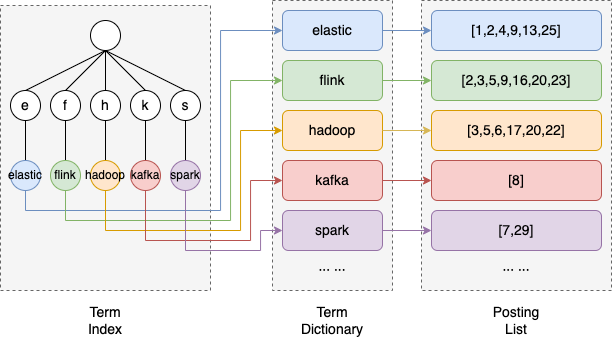

- 基本概念
    - index
        - 一个 索引 就是一个拥有几分相似特征的文档的集合。ES 将数据存储于一个或多个索引中，索引 就相当于 SQL 中的一个数据库。
    - type（ES7废弃）
        - 在一个索引中，你可以定义一种或多种类型。一个类型是你的索引的一个逻辑上的分类/分区，其语义完全由你来定。通常，会为具有一组共同字段的文档定义一个类型，相当于数据库的表。
    - document
        - 文档是 Lucene 索引和搜索的 原子单位，它是包含了一个或多个域的容器，基于 Json 格式进行表示。
    - field
        - 字段
    - mapping
        - Mapping 是定义文档及其包含的字段如何存储和索引的过程。
        - 类似于建表语法

- 倒排索引
    - 分词
        - 分词就是通过分词器把全文转换为一些列的词条（Term/Token）的过程
        - 默认使用的分词器不支持中文，按符号和空格切分，单词会转为小写
        - 加插件来同时支持中英文分词
    - 根据词来检索docId
    - 详细
        - Term（词条）：词条是索引里面最小的存储和查询单元。一段文本经过分析器分析以后就会输出一串词条。一般来说英文语境中词条是一个单词，中文语境中一个词条是分词后的一个词组。
        - Term Dictionary（词典）：词典是词条的集合，顾名思义，词典中维护的是Term。词典一般是由文本集合中出现过的所有词条所组成的集合，磁盘上的每个block都利用公共前缀来压缩空间。
        - Term Index（词条索引）：由于词典中维护着文本中所有的词条，为了在其中更快的找到某个词条，我们为词条建立索引，可以通过词条索引中的词条前缀找到（索引只存了前缀）词条在词典的大致位置，再通过二分法在词典进行搜索。通过压缩算法FST（Finite State Transducers），词条索引的大小只有所有词条的几十分之一，因此词条索引可以存储在内存中，以提供更快的查找速度。
        - Posting List（倒排表）：倒排表记录的是词条出现在哪些文档里，以及出现的位置、词频率（在文档中出现的次数）等信息，使用跳表来计算交并集（and、or）、范围查询和短语查询（快速定位文档位置）。倒排表中的每条记录称为一个倒排项（posting）。

 

- 分页
    - from size，深度查询性能低下
    - search after，游标，每次返回一个字符串id，下一页的依据